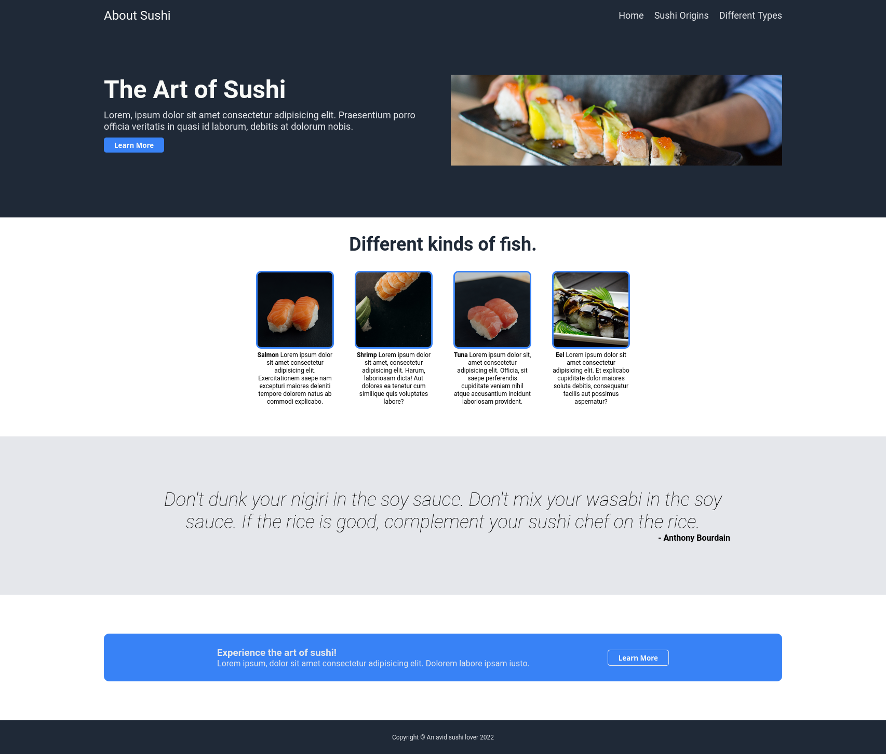

# Landing Page

## Table of Contents
- [Introduction](#introduction)
- [Demo](#demo)
- [Template](#template)
- [Links](#links)
- [License](#license)

## Introduction
This project explores the use of flexbox for layout design.  Elements are responsive.

## [Demo](https://atia009.github.io/the-odin-project/01-landing-page/)

## Template

## Links
- [Instructions](https://www.theodinproject.com/paths/foundations/courses/foundations/lessons/landing-page)

## License
- [MIT License](https://badges.mit-license.org)
- Copyright 2022 @ Aaron Tia