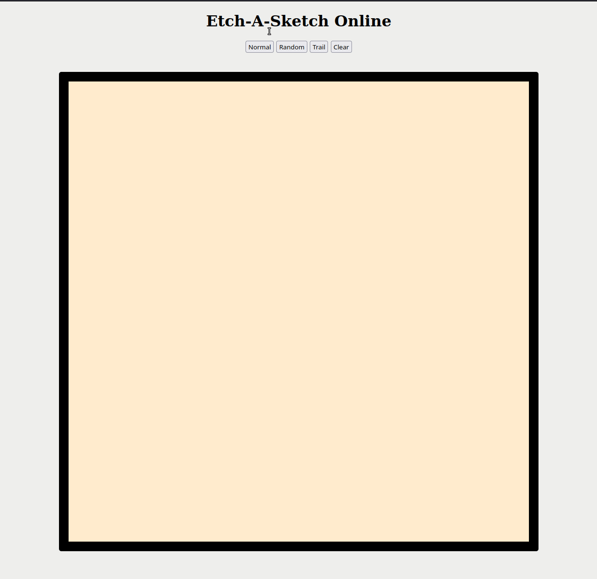

# Rock, Paper, Scissors

## Table of Contents
- [Introduction](#introduction)
- [Demo](#demo)
- [Features](#features)
- [Links](#links)
- [License](#license)

## Introduction
This project explores DOM methods and functions.  DOM manipulation along with event listeners is used for generating the grid and logic of the three different modes of sketching.

## [Demo](https://atia009.github.io/the-odin-project/03-etch-a-sketch/)
 \
There are three different modes available along with an option to clear the canvas.

## Features

## Links
- [Instructions](https://www.theodinproject.com/paths/foundations/courses/foundations/lessons/etch-a-sketch-project)

## License
- [MIT License](https://badges.mit-license.org)
- Copyright 2022 @ Aaron Tia