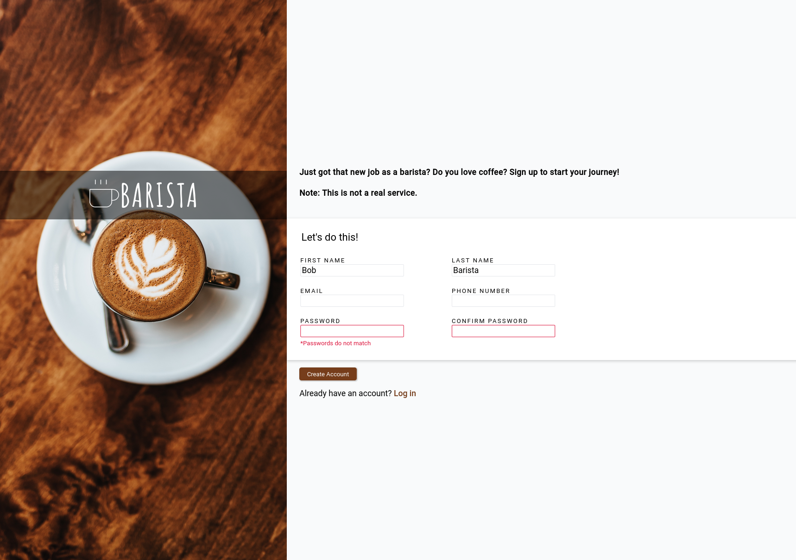

# Sign-up Form

## Table of Contents
- [Introduction](#introduction)
- [Demo](#demo)
- [Features](#features)
- [Template](#template)
- [Links](#links)
- [License](#license)

## Introduction
This project focuses on primarily on forms and pseudo-class. Fluid and responsive elements are achieved through CSS functions like calc() and clamp().

## Demo

This project can be accessed through the following link: \
[Sign-up Form](https://atia009.github.io/the-odin-project/05-sign-up-form/)

## Template

## Features
- Visual indicator with message on required inputs
- Selected input has a blue border and box shadow using focus pseudo-class

## Links
- [Instructions](https://www.theodinproject.com/paths/full-stack-javascript/courses/intermediate-html-and-css/lessons/sign-up-form)

## License
- [MIT License](https://badges.mit-license.org)
- Copyright 2022 @ Aaron Tia