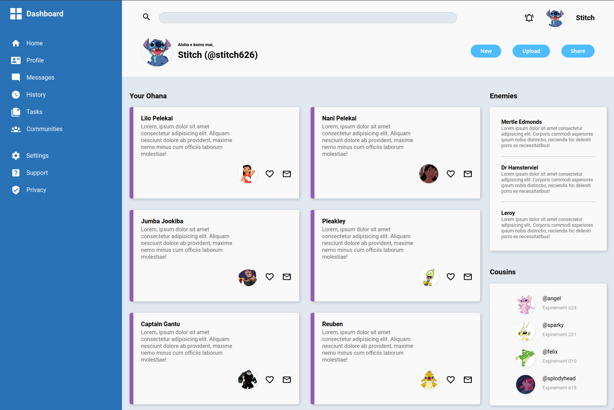

# Ohana

## Table of Contents

- [Introduction](#introduction)
- [Demo](#demo)
- [Template](#template)
- [Thoughts](#thoughts)
- [Colors](#colors)
- [Links](#links)
- [License](#license)

## Introduction

Ohana is a mockup CMS that allows users to get a quick overview of close family members, cousins, and enemies. This project focuses on using CSS Grid to build a full dashboard design.  

## Demo

This project is hosted with GitHub pages and can be found at
[atia009.github.io/the-odin-project/06-admin-dashboard/](https://atia009.github.io/the-odin-project/06-admin-dashboard/).

## Template

## Thoughts

The html markup was the inital starting point and classes were added for styling. There was some difficulty with getting the desired layout, but using relative units with absolute units when defining the grid tracks helped. While CSS grid was mainly used in this project, there are some nested grid and flex containers. The layout was the first to be styled with each subsequent section being styled afterwards. The colors used in the project are derived from the actual colors that are used for the character design of Stitch. SVGs were taken from [material design icons](https://materialdesignicons.com/) and the images from the [lilo and stitch wiki](https://liloandstitch.fandom.com/wiki/Lilo_%26_Stitch_Wiki). This was a more invovled project that required more testing to get the desired result but it also showed how powerful grid can be in creating powerful layouts.

## Colors

-  `#2972b6`
-  `#945cb4`
-  `#4ebcff`
-  `#002790`
-  `#001d4f`
-  `#e2e8f0`

## Links

- [Instructions](https://www.theodinproject.com/lessons/node-path-intermediate-html-and-css-admin-dashboard)

## License

- [MIT License](https://badges.mit-license.org)
- Copyright 2022 @ Aaron Tia
